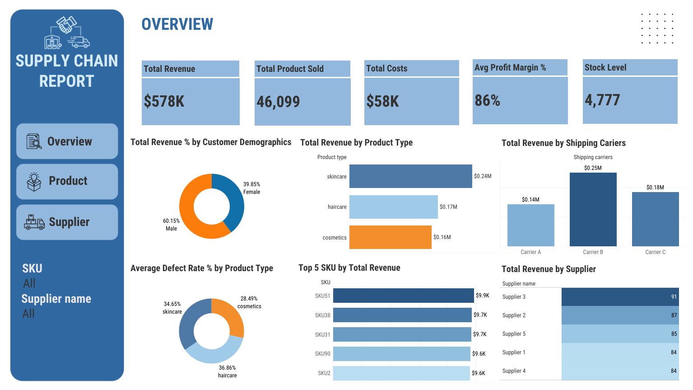
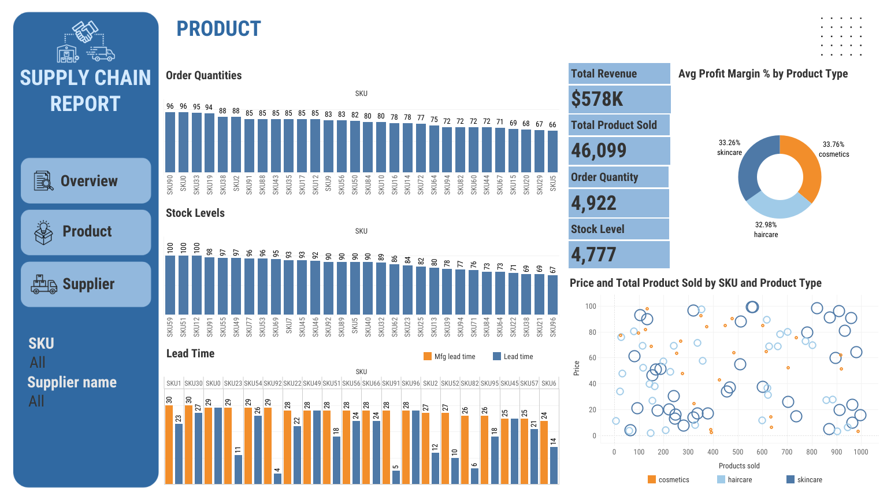
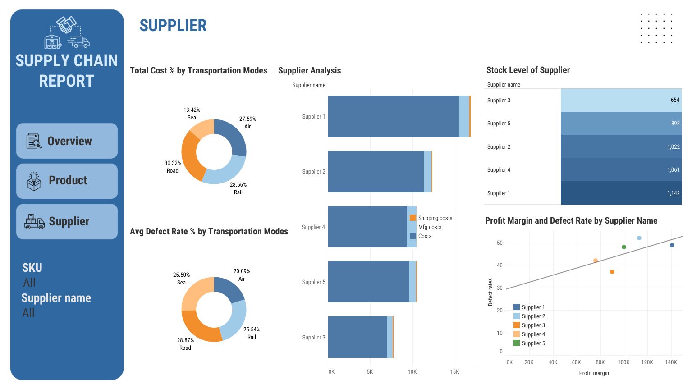

### 📊 Dashboard Supply Chain Analytics

Dataset yang digunakan dalam dashboard ini merupakan data **supply chain** tahun 2023 yang berisi 100 entri data. Dashboard supply chain ini dirancang untuk memberikan gambaran menyeluruh mengenai **kinerja rantai pasok (supply chain performance)** dari sisi penjualan, produk, dan supplier. Dengan visualisasi ini, pengguna dapat:

* Memantau **pendapatan, margin, dan performa produk** berdasarkan kategori maupun SKU.
* Melihat **tingkat persediaan dan lead time** untuk mengantisipasi risiko stock-out.
* Mengevaluasi **kinerja supplier** berdasarkan profit margin, biaya, dan defect rate.
* Menganalisis **efisiensi distribusi** berdasarkan jenis transportasi yang digunakan.
* Mengidentifikasi kontribusi dari **shipping carriers** terhadap revenue.
* Memahami profil pelanggan melalui **customer demographics**.

Dashboard ini menjadi alat bantu strategis bagi perusahaan untuk meningkatkan **efisiensi operasional**, mengurangi biaya, dan mengoptimalkan **strategi penjualan serta manajemen supplier**.

---

## 🔗 Live Demo
[**View Dashboard on Tableau Public**](https://public.tableau.com/views/SupplyChainDashboard_17564063562400/Overview?:language=en-US&:sid=&:redirect=auth&:display_count=n&:origin=viz_share_link)

---

### 📊 **Insight dari Dashboard**

### 1. **Overview Dashboard**

* **Total Revenue**: \$578K dengan total produk terjual 46,099 unit.
* **Profit Margin Tinggi**: rata-rata 86% → menunjukkan efisiensi operasional cukup baik.
* **Revenue Berdasarkan Produk**:

  * Skincare menyumbang pendapatan tertinggi (\$0.24M).
  * Haircare (\$0.17M) dan Cosmetics (\$0.16M) tertinggal.
* **Customer Demographics**: mayoritas pembeli adalah **laki-laki (60.15%)**.
* **Top 5 SKU**: SKU51, SKU38, SKU31, SKU90, dan SKU2 menyumbang revenue signifikan.
* **Shipping Carriers**: Carrier B menyumbang revenue tertinggi (\$0.25M).
* **Supplier**: Supplier 3 unggul dengan margin 91 dan revenue terbesar.

➡️ **Insight**: Produk skincare menjadi andalan revenue. Customer pria mendominasi sehingga strategi marketing bisa diarahkan ke segmen ini. Carrier B paling efisien, bisa dijadikan partner utama.

---

### 2. **Product Dashboard**

* **Order Quantities**: SKU50, SKU10, dan SKU33 memiliki jumlah order tertinggi (95–96 unit).
* **Stock Levels**: SKU55, SKU17, dan SKU21 memiliki stok penuh (100), sementara SKU06 paling rendah (67).
* **Lead Time**: beberapa SKU memiliki **manufacturing lead time lebih lama** (contoh: SKU1 = 30 hari vs SKU23 = 11 hari).
* **Profit Margin Produk**: relatif seimbang antara **cosmetics (33.76%), skincare (33.26%), dan haircare (32.98%)**.
* **Scatter Plot (Price vs Products Sold)**: produk skincare cenderung memiliki demand lebih tinggi meski dengan harga premium.

➡️ **Insight**: Stok produk dengan order tinggi harus dijaga agar tidak terjadi stock-out. Lead time panjang perlu dioptimalkan untuk SKU tertentu agar tidak menghambat supply.

---

### 3. **Supplier Dashboard**

* **Biaya Transportasi**:

  * Road (30.32%) dan Rail (28.66%) menyumbang biaya terbesar.
  * Sea transport lebih murah (13.42%), tapi mungkin lebih lambat.
* **Defect Rate**: relatif tinggi pada transportasi via Road (28.87%) → berpotensi menurunkan kualitas barang.
* **Supplier Analysis**: Supplier 1 paling tinggi biayanya, tetapi Supplier 3 memiliki **stock level terendah (654)** meski profit marginnya tinggi.
* **Profit Margin vs Defect Rate**: Supplier 5 memiliki margin baik tapi defect rate lebih tinggi dibanding Supplier 2.

➡️ **Insight**: Supplier 3 perlu perhatian karena stok rendah bisa mengganggu supply meski profit tinggi. Transportasi via Road meningkatkan defect rate, perlu dikaji alternatif distribusi lain.

---

## ✅ **Rekomendasi Bisnis**

1. **Strategi Produk**

   * Fokus promosi pada produk **skincare** karena kontribusi revenue terbesar.
   * Jaga ketersediaan SKU top seller (SKU51, SKU38, SKU31).
   * Lakukan perbaikan lead time untuk SKU dengan demand tinggi namun produksi lambat.

2. **Customer Targeting**

   * Tingkatkan kampanye pemasaran yang menyasar **laki-laki**, misalnya skincare untuk pria.
   * Gunakan segmentasi pelanggan untuk cosmetics agar market share bisa meningkat.

3. **Supplier & Logistik**

   * Evaluasi **Supplier 1** karena biayanya tinggi → negosiasi harga atau diversifikasi ke supplier lain.
   * Perkuat hubungan dengan **Supplier 3** tapi pastikan stok ditingkatkan.
   * Kurangi ketergantungan transportasi via **Road**, alihkan sebagian ke Rail/Sea untuk menekan defect rate.

4. **Shipping Carriers**

   * Prioritaskan **Carrier B** karena kontribusi revenue terbesar.
   * Lakukan evaluasi Carrier A yang kontribusinya jauh lebih rendah.

---
Apakah kamu mau aku rangkum hasil analisis + insight ini menjadi **narasi pengenalan + insight + rekomendasi bisnis** (biar rapi seperti laporan yang bisa kamu masukkan ke GitHub)?

